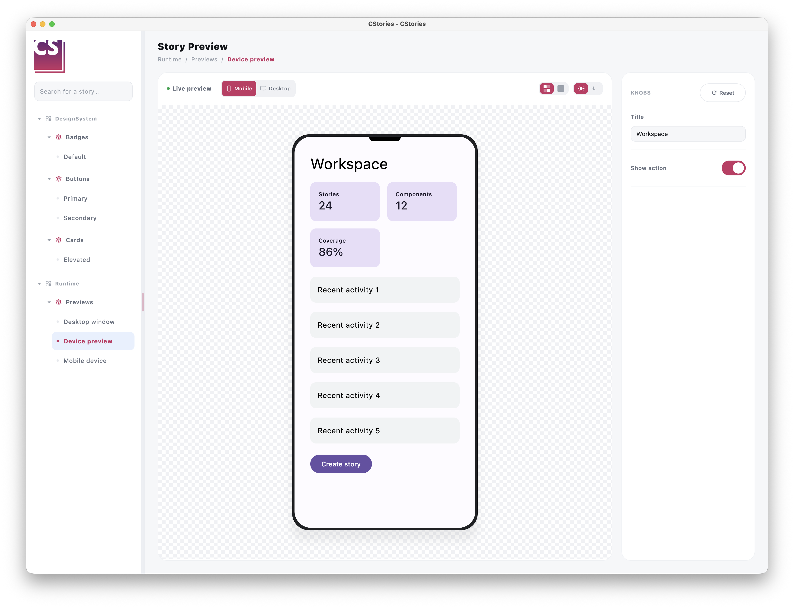
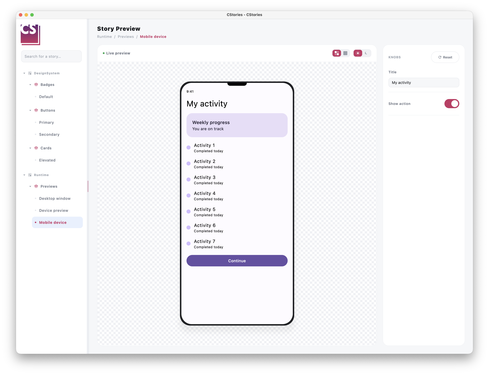

# Preview a story on mobile and desktop

`DevicePreview` lets you render the same story inside a simulated mobile device or desktop window. It is useful for
checking a responsive screen without creating separate stories for each target format.

```kotlin
import io.cstories.runtime.DevicePreview

@CStory(collection = "Screens", group = "Profile", name = "Responsive")
@Composable
fun ResponsiveProfileStory() {
    DevicePreview {
        ProfileScreen()
    }
}
```


## Switch the preview format

When a story containing `DevicePreview` is rendered in the CStories catalog, the catalog automatically adds a
`Mobile`/`Desktop` switch to the story toolbar, next to the live preview controls. The switch is only shown for stories
that use `DevicePreview`.

The selected format changes the viewport without changing the story content:

- `Mobile` renders the content inside `MobileDevicePreview`.
- `Desktop` renders the content inside `DesktopDevicePreview`, including a simulated window title bar.

Outside the CStories catalog, `DevicePreview` renders the same switch above the preview so the component remains useful
in a standalone Compose screen.

## Configure the initial format

The default format is mobile. Use `initialDevice` to open the story in desktop mode instead:

```kotlin
import io.cstories.runtime.DevicePreview
import io.cstories.runtime.PreviewDevice

DevicePreview(
    initialDevice = PreviewDevice.Desktop,
) {
    DashboardScreen()
}
```

`PreviewDevice` has two values:

- `PreviewDevice.Mobile`
- `PreviewDevice.Desktop`

## Configure the simulated viewports

The mobile and desktop viewports can be configured independently:

```kotlin
import androidx.compose.ui.unit.dp
import io.cstories.runtime.DesktopDevice
import io.cstories.runtime.DevicePreview
import io.cstories.runtime.MobileDevice

DevicePreview(
    mobileDevice = MobileDevice(
        width = 390.dp,
        height = 844.dp,
    ),
    desktopDevice = DesktopDevice(
        width = 1280.dp,
        height = 800.dp,
        title = "Dashboard",
    ),
) {
    DashboardScreen()
}
```

The default dimensions are `390.dp x 844.dp` for mobile and `1280.dp x 800.dp` for desktop. Both previews scroll
vertically when their content is taller than the simulated viewport.

## Use the mobile preview directly

Use `MobileDevicePreview` when a story should always render as a mobile screen and does not need a format switch:

```kotlin
import io.cstories.runtime.MobileDevicePreview

MobileDevicePreview {
    ProfileScreen()
}
```

`MobileDevicePreview` renders a phone-shaped viewport with rounded corners, a device frame and a top camera cutout.
Its default size is `390.dp x 844.dp`. Configure the device when another mobile format is useful:

```kotlin
import androidx.compose.ui.unit.dp
import io.cstories.runtime.MobileDevice
import io.cstories.runtime.MobileDevicePreview

MobileDevicePreview(
    device = MobileDevice(
        width = 375.dp,
        height = 812.dp,
        cornerRadius = 32.dp,
    ),
) {
    ProfileScreen()
}
```

The content scrolls vertically inside the simulated screen when it is taller than the viewport.



## Use the desktop preview directly

Use `DesktopDevicePreview` when a story should always render as a desktop window and does not need a format switch:

```kotlin
import io.cstories.runtime.DesktopDevicePreview

DesktopDevicePreview {
    DashboardScreen()
}
```

`DesktopDevicePreview` renders a desktop window with a title bar, decorative window controls and a scrollable content
viewport. Its default size is `1280.dp x 800.dp`. Configure the window size and title when needed:

```kotlin
import androidx.compose.ui.unit.dp
import io.cstories.runtime.DesktopDevice
import io.cstories.runtime.DesktopDevicePreview

DesktopDevicePreview(
    device = DesktopDevice(
        width = 1440.dp,
        height = 900.dp,
        title = "Analytics",
    ),
) {
    DashboardScreen()
}
```

The window controls are decorative only. They do not resize or close the native CStories application window.


## React to format changes

Use `onDeviceChanged` when the story needs to observe the active format:

```kotlin
var activeDevice by remember { mutableStateOf(PreviewDevice.Mobile) }

DevicePreview(
    onDeviceChanged = { activeDevice = it },
) {
    DashboardScreen()
}

Text("Previewing: ${activeDevice.name}")
```

The callback is invoked once with `initialDevice` and again whenever the user selects a different format. It is not
invoked when the user selects the already active format.

## Keep one device preview per story

A story should normally contain a single `DevicePreview`. The catalog toolbar exposes one Mobile/Desktop switch per
story, so multiple instances would share the same toolbar control ambiguously.
