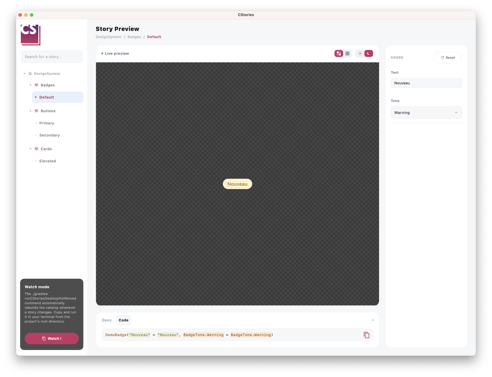

# Customize the catalog theme

Every story's canvas has a light/dark switch in its toolbar, letting you check how a component looks against both
backgrounds without leaving the catalog.



## Default behavior

By default, toggling it wraps the previewed story in a plain Material3 `MaterialTheme` using
`darkColorScheme()`/`lightColorScheme()` — enough for components that already rely on `MaterialTheme.colorScheme`
for their colors.

## Using your own theme

If your design system uses its own theme instead of Material3 (a `MyTheme(isDark) { ... }`, for example), define a
wrapper object:

```kotlin
import io.cstories.runtime.CStoriesThemeWrapper

object CustomCStoriesThemeWrapper : CStoriesThemeWrapper {
    @Composable
    override operator fun invoke(isDark: Boolean, content: @Composable () -> Unit) {
        MyTheme(isDark = isDark, content = content)
    }
}
```

The object is discovered automatically by the CStories plugin. No Gradle configuration is required. If the object is
not present, `DefaultCStoriesThemeWrapper` is used.

## Override a story

A story can use another theme without changing the global catalog wrapper. First define an object that implements
`CStoriesThemeWrapper`. The object must implement `invoke`, which receives the selected light/dark state and must render
the story inside your theme:

```kotlin
object MyThemeWrapper : CStoriesThemeWrapper {
    @Composable
    override operator fun invoke(isDark: Boolean, content: @Composable () -> Unit) {
        MyTheme(isDark = isDark, content = content)
    }
}
```

Then reference that object from the story's `themeWrapper` argument:

```kotlin

@CStory(
    collection = "Components",
    group = "Buttons",
    name = "Alternative button",
    themeWrapper = MyThemeWrapper::class,
)
@Composable
fun AlternativeButtonStory() {
    AlternativeButton()
}
```

The story-specific wrapper takes priority over the wrapper passed to `CStoriesApp`. Stories without a
`themeWrapper` argument use the catalog wrapper, or `DefaultCStoriesThemeWrapper` when no global wrapper was discovered.

## Device previews

When a story uses `DevicePreview`, `MobileDevicePreview`, or `DesktopDevicePreview`, the light/dark selection is applied
inside the simulated viewport. The phone or desktop window content is therefore rendered with the selected theme, while
the surrounding canvas keep the catalog UI theme.

```kotlin
@CStory(collection = "Screens", group = "Profile", name = "Responsive")
@Composable
fun ResponsiveProfileStory() {
    DevicePreview {
        ProfileScreen()
    }
}
```

For a direct `MobileDevicePreview` or `DesktopDevicePreview`, the same rule applies: only the content inside the
simulated device is wrapped by the selected theme.
