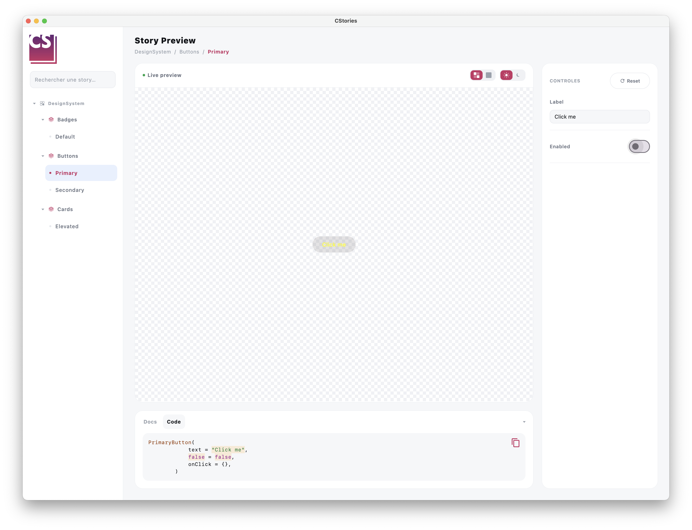

# Ajouter des contrôles à une story

Les stories deviennent bien plus utiles lorsqu'elles permettent d'explorer les états d'un composant de manière
interactive. CStories fournit un petit ensemble de knobs (contrôles) pour cela, déclarés à l'intérieur d'un
`KnobPanel`.



## `KnobPanel`

`KnobPanel` déclare les contrôles d'une story. Appelez-le depuis une composable `@CStory`, à côté de l'aperçu réel :

```kotlin
@CStory(collection = "DesignSystem", group = "Buttons", name = "Primary")
@Composable
fun PrimaryButtonStory() {
    var label by remember { mutableStateOf("Click me") }

    KnobPanel {
        TextKnob(label = "Label", value = label, onValueChange = { label = it })
    }

    PrimaryButton(text = label, onClick = {})
}
```

Lorsqu'il est rendu dans le catalogue, ce contenu est déplacé de manière transparente vers le panneau de contrôles
dédié du runtime, afin que le canvas n'affiche jamais que l'aperçu réel de la story.

## `TextKnob`

Un champ de texte libre, pour les props qui prennent une chaîne arbitraire :

```kotlin
var label by remember { mutableStateOf("Click me") }

KnobPanel {
    TextKnob(
        label = "Label",
        value = label,
        onValueChange = { label = it },
        codeKey = "label",
    )
}
```

## `BooleanKnob`

Un interrupteur, pour les props qui prennent un `Boolean` :

```kotlin
var enabled by remember { mutableStateOf(true) }

KnobPanel {
    BooleanKnob(
        label = "Enabled",
        value = enabled,
        onValueChange = { enabled = it },
        codeKey = "enabled",
    )
}
```

## `SelectKnob`

Un contrôle de type liste déroulante, pour les props qui prennent une valeur parmi un ensemble fixe d'options.

### Avec une liste de chaînes

```kotlin
var tone by remember { mutableStateOf("Success") }

KnobPanel {
    SelectKnob(
        label = "Tone",
        value = tone,
        options = listOf("Success", "Warning", "Danger"),
        onValueChange = { tone = it },
        codeKey = "tone",
    )
}
```

### Avec un enum

Lorsque la prop repose sur un `enum`, privilégiez la surcharge typée enum : elle dérive automatiquement la liste
des options depuis `enumValues<T>()`, ce qui évite de devoir maintenir manuellement la liste des options à jour.

```kotlin
var tone by remember { mutableStateOf(BadgeTone.Success) }

KnobPanel {
    SelectKnob(
        label = "Tone",
        value = tone,
        onValueChange = { tone = it },
        codeKey = "tone",
    )
}

DemoBadge(text = "New", tone = tone)
```

### À propos de `codeKey`

`codeKey` relie la valeur courante d'un contrôle à l'onglet "Code" généré de la story : à chaque changement de
valeur d'un contrôle, l'extrait de code affiché dans le catalogue se met à jour pour refléter la nouvelle valeur.
Pour la surcharge enum, cela affiche automatiquement la constante entièrement qualifiée (par exemple
`BadgeTone.Success`) plutôt qu'une chaîne entre guillemets, afin que l'extrait reste du Kotlin valide sans travail
supplémentaire de votre part.

## Bonnes pratique

:::tip
- exposez des contrôles pour les props qui comptent réellement pour explorer les états du composant
- gardez une story ciblée : quelques contrôles bien choisis valent mieux qu'une douzaine
- privilégiez la surcharge `SelectKnob` typée enum dès que la prop repose sur un enum
:::