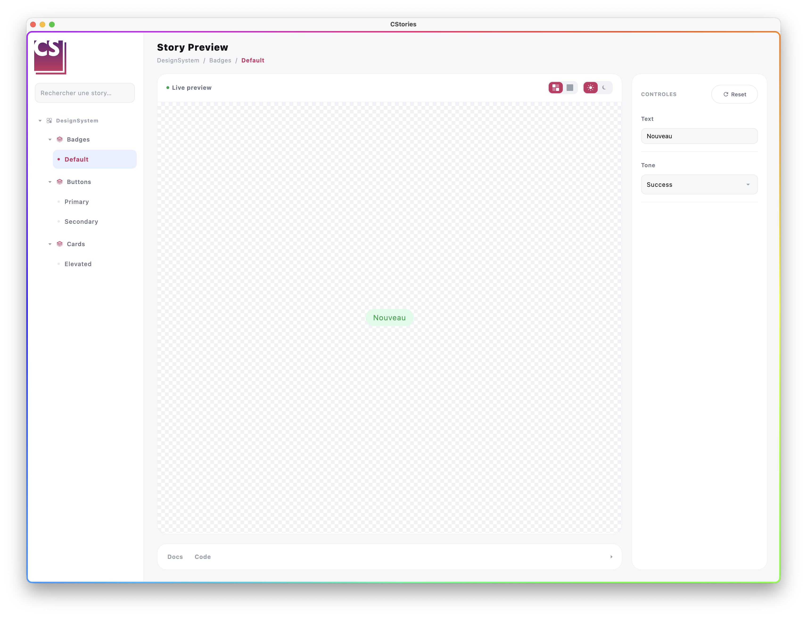

# Lancer le catalogue desktop

Le catalogue desktop s'exécute sur la cible `jvm()` et constitue le moyen recommandé de travailler sur les stories
en local : pas de navigateur, pas de toolchain Wasm, et la boucle d'itération la plus rapide disponible.

## Prérequis

Votre module doit déclarer une cible `jvm()` :

```kotlin
kotlin {
    jvm()
}
```

## Lancer le catalogue

```bash
./gradlew runCStoriesDesktop
```

Cela ouvre le catalogue sous forme de fenêtre desktop.

## Hot reload

Pour un développement actif, utilisez plutôt la variante avec hot reload :

```bash
./gradlew runCStoriesDesktopHotReload
```



Cela garde le catalogue desktop en cours d'exécution et injecte les changements de code dans le processus actif,
sans redémarrage complet — bien plus rapide que de relancer l'application à chaque modification.

## Quand redémarrer manuellement

La tâche `runCStoriesDesktop` simple ne supporte pas le hot reload : redémarrez-la manuellement après chaque
modification. Privilégiez `runCStoriesDesktopHotReload` pendant l'itération sur les stories, et revenez à
`runCStoriesDesktop` pour un lancement propre.
