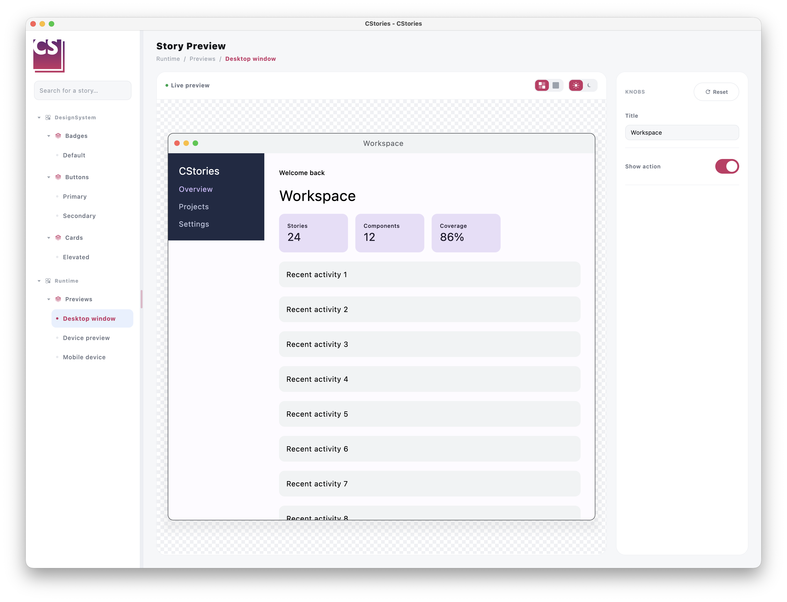

# Prévisualiser une story sur mobile et desktop

`DevicePreview` permet de rendre une même story dans un appareil mobile ou une fenêtre desktop simulée. Il est utile
pour vérifier un écran responsive sans créer une story distincte pour chaque format.

```kotlin
import io.cstories.runtime.DevicePreview

@CStory(collection = "Screens", group = "Profile", name = "Responsive")
@Composable
fun ResponsiveProfileStory() {
    DevicePreview {
        ProfileScreen()
    }
}
```


## Changer le format de prévisualisation

Lorsqu'une story contenant `DevicePreview` est affichée dans le catalogue CStories, celui-ci ajoute automatiquement un
switch `Mobile`/`Desktop` dans la barre d'outils de la story, à côté des contrôles de l'aperçu. Le switch n'est affiché
que pour les stories qui utilisent `DevicePreview`.

Le format sélectionné change le viewport sans modifier le contenu de la story :

- `Mobile` rend le contenu dans `MobileDevicePreview`.
- `Desktop` rend le contenu dans `DesktopDevicePreview`, avec une barre de titre de fenêtre simulée.

En dehors du catalogue CStories, `DevicePreview` affiche le même switch au-dessus de l'aperçu afin de rester utilisable
dans un écran Compose autonome.

## Configurer le format initial

Le format par défaut est mobile. Utilisez `initialDevice` pour ouvrir la story en mode desktop :

```kotlin
import io.cstories.runtime.DevicePreview
import io.cstories.runtime.PreviewDevice

DevicePreview(
    initialDevice = PreviewDevice.Desktop,
) {
    DashboardScreen()
}
```

`PreviewDevice` possède deux valeurs :

- `PreviewDevice.Mobile`
- `PreviewDevice.Desktop`

## Configurer les viewports simulés

Les viewports mobile et desktop peuvent être configurés indépendamment :

```kotlin
import androidx.compose.ui.unit.dp
import io.cstories.runtime.DesktopDevice
import io.cstories.runtime.DevicePreview
import io.cstories.runtime.MobileDevice

DevicePreview(
    mobileDevice = MobileDevice(
        width = 390.dp,
        height = 844.dp,
    ),
    desktopDevice = DesktopDevice(
        width = 1280.dp,
        height = 800.dp,
        title = "Dashboard",
    ),
) {
    DashboardScreen()
}
```

Les dimensions par défaut sont `390.dp x 844.dp` pour le mobile et `1280.dp x 800.dp` pour le desktop. Les deux
prévisualisations défilent verticalement lorsque leur contenu dépasse la hauteur du viewport simulé.

## Utiliser directement la preview mobile

Utilisez `MobileDevicePreview` lorsqu'une story doit toujours être rendue comme un écran mobile et n'a pas besoin d'un
switch de format :

```kotlin
import io.cstories.runtime.MobileDevicePreview

MobileDevicePreview {
    ProfileScreen()
}
```

`MobileDevicePreview` rend un viewport en forme de téléphone avec des coins arrondis, un cadre et une encoche de caméra
supérieure. Sa taille par défaut est `390.dp x 844.dp`. Configurez l'appareil lorsqu'un autre format mobile est utile :

```kotlin
import androidx.compose.ui.unit.dp
import io.cstories.runtime.MobileDevice
import io.cstories.runtime.MobileDevicePreview

MobileDevicePreview(
    device = MobileDevice(
        width = 375.dp,
        height = 812.dp,
        cornerRadius = 32.dp,
    ),
) {
    ProfileScreen()
}
```

Le contenu défile verticalement à l'intérieur de l'écran simulé lorsqu'il dépasse la hauteur du viewport.


## Utiliser directement la preview desktop

Utilisez `DesktopDevicePreview` lorsqu'une story doit toujours être rendue comme une fenêtre desktop et n'a pas besoin
d'un switch de format :

```kotlin
import io.cstories.runtime.DesktopDevicePreview

DesktopDevicePreview {
    DashboardScreen()
}
```

`DesktopDevicePreview` rend une fenêtre desktop avec une barre de titre, des contrôles de fenêtre décoratifs et un
viewport de contenu défilable. Sa taille par défaut est `1280.dp x 800.dp`. Configurez la taille et le titre de la
fenêtre si nécessaire :

```kotlin
import androidx.compose.ui.unit.dp
import io.cstories.runtime.DesktopDevice
import io.cstories.runtime.DesktopDevicePreview

DesktopDevicePreview(
    device = DesktopDevice(
        width = 1440.dp,
        height = 900.dp,
        title = "Analytics",
    ),
) {
    DashboardScreen()
}
```

Les contrôles de la fenêtre sont uniquement décoratifs. Ils ne redimensionnent pas et ne ferment pas la fenêtre native
de l'application CStories.



## Réagir aux changements de format

Utilisez `onDeviceChanged` lorsque la story doit observer le format actif :

```kotlin
var activeDevice by remember { mutableStateOf(PreviewDevice.Mobile) }

DevicePreview(
    onDeviceChanged = { activeDevice = it },
) {
    DashboardScreen()
}

Text("Prévisualisation : ${activeDevice.name}")
```

Le callback est appelé une première fois avec `initialDevice`, puis à chaque sélection d'un format différent. Il n'est
pas appelé lorsque l'utilisateur sélectionne le format déjà actif.

## Utiliser une seule preview par story

Une story devrait normalement contenir un seul `DevicePreview`. La barre d'outils du catalogue expose un switch
Mobile/Desktop par story ; plusieurs instances rendraient ce contrôle ambigu.
